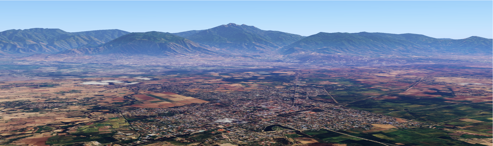

 

## မော်ကွန်းတိုက်အညွှန်း

* [တပ်ကုန်းမြို့သမိုင်း](./town-history.html) - မြို့၏ ခေတ်အဆက်ဆက် သမိုင်းကြောင်း။
* [တပ်ကုန်းမြို့နယ်နောက်ခံသမိုင်း](./township-history.html) - ဒေသတွင်း မြို့နယ်အဆင့် နောက်ခံသမိုင်း။
* [အထင်ကရ အရေးကြီးနေရာများ](./landmarks.html) - အထင်ကရ ကျေးရွာများ၊ နေရာများနှင့် အဆောက်အအုံများ။
* [အထင်ကရဖြစ်ရပ်များ](./timeline.html) - ခေတ်အဆက်ဆက် အဖြစ်အပျက် ပြက္ခဒိန်။
* [မှတ်တမ်းစာအုပ်များ](./library.html) - မှတ်တမ်းမှတ်ရာစာအုပ်များ၊ ဓာတ်ပုံများနှင့် မြေပုံများ။
* [မြို့မြေပုံ](./map.html) - ဒေသတွင်း ခေတ်အဆက်ဆက် ဖြစ်ပေါ်ပြောင်းလဲမှု အခြေအနေများပြ မြေပုံ။
* [လေ့လာမှုနှင့် သုတေသနများ](./research.html) - မြို့နယ်တွင်း လေ့လာမှုသုတေသနအမျိုးမျိုးနှင့် ရလဒ်များ။

---

  

