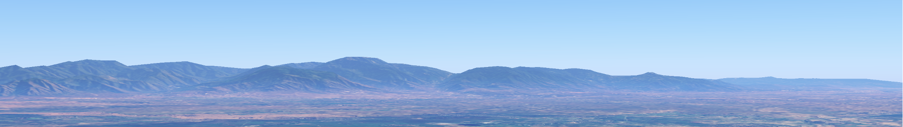

<h2 style="margin-top: -5px; margin-bottom: 15px;">မော်ကွန်းတိုက်အညွှန်း</h2>

* [တပ်ကုန်းမြို့နယ်နောက်ခံသမိုင်း](./township-history.html) - ဒေသတွင်း မြို့နယ်အဆင့် ခေတ်အဆက်ဆက် နောက်ခံသမိုင်း။
* [တပ်ကုန်းမြို့သမိုင်း](./town-history.html) - မြို့၏ နောက်ခံသမိုင်းကြောင်း။
* [အထင်ကရနေရာများနှင့်လူပုဂ္ဂိုလ်များ](./landmarks.html) - အထင်ကရကျေးရွာများ၊ နေရာများ၊ အဆောက်အအုံများနှင့် ထင်ရှားကျော်ကြားသူများ။
* [အထင်ကရဖြစ်ရပ်များ](./timeline.html) - ခေတ်အဆက်ဆက် အဖြစ်အပျက် ပြက္ခဒိန်။
* [စာကြည့်တိုက်](./library.html) - မှတ်တမ်းမှတ်ရာများ၊ စာအုပ်များ၊ ဓာတ်ပုံများနှင့် မြေပုံများ။
* [မြို့မြေပုံ](./map.html) - ဒေသတွင်း ခေတ်အဆက်ဆက် ဖြစ်ပေါ်ပြောင်းလဲမှု အခြေအနေများပြ ဘက်စုံသုံးမြေပုံ။
* [လေ့လာမှုနှင့်သုတေသနများ](./research.html) - မြို့နယ်တွင်း လေ့လာမှုသုတေသနအမျိုးမျိုးနှင့် ရလဒ်များ။
* [သတင်းနှင့်လှုပ်ရှားမှုများ](./activity.html) - မော်ကွန်းတိုက်၏ လှုပ်ရှားဆောင်ရွက်မှုများနှင့် ရပ်ရွာ၏ကူညီပံ့ပို့မှုများ။

  
  

    

      <a href="./about.html" class="p-btn">About Us</a>
      <a href="./contact.html" class="p-btn">How to Contribute</a>
    

    
      This is a non-profit, community-based digital archive managed by Tatkon-archivE for educational and cultural preservation purposes only.   All materials are published with permission or under general public interest guidelines. Full copyright remains with the original creators.   Content without explicit direct clearance will only be featured through analytical summaries and properly credited references.  If you would like to contribute historical data, photographs, or records to Tatkon-archivE, or if you have any inquiries regarding copyright and content clearance,   please feel free to reach out to us: tatkon.archive@gmail.com
    
  

